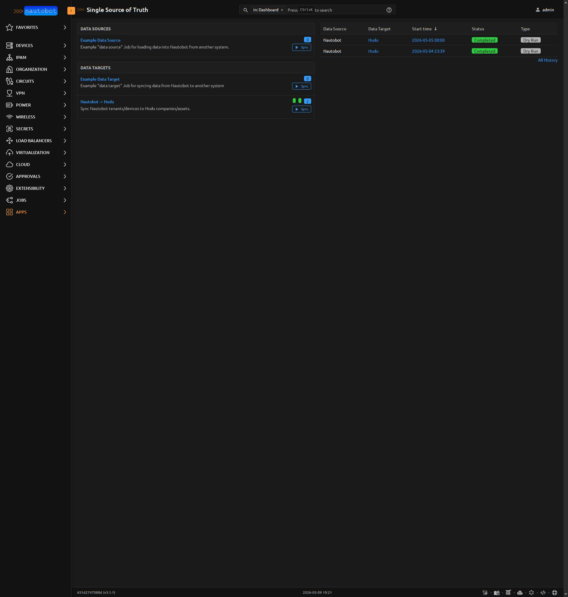
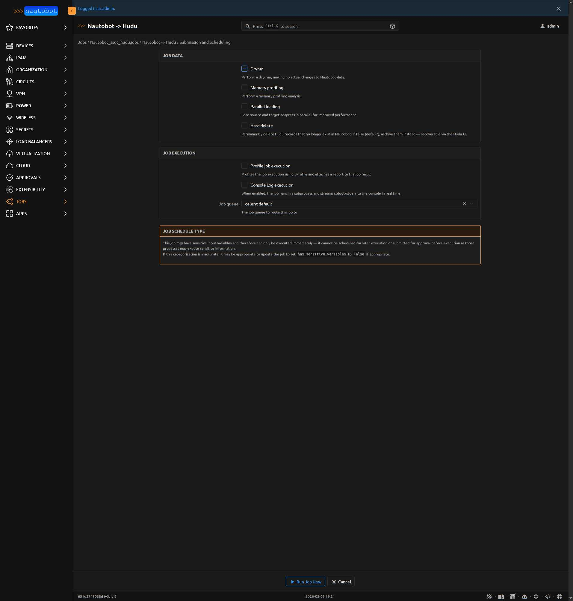
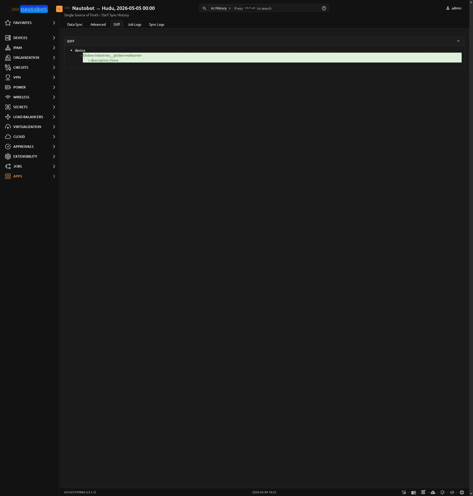
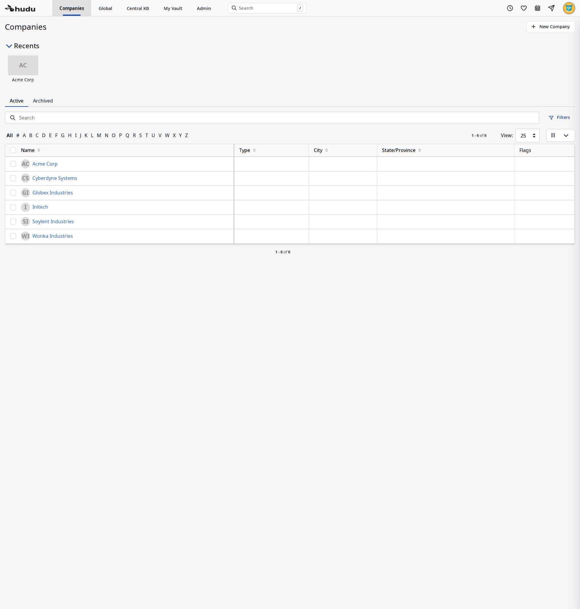
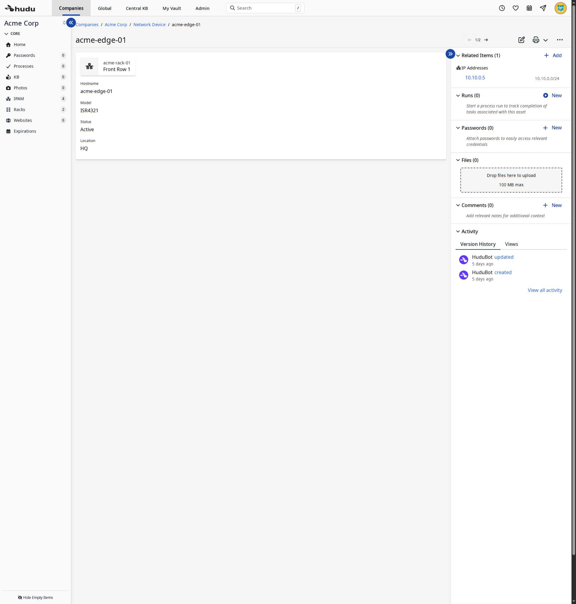

# Getting Started with the App

This walks through the first end-to-end sync — from "I just installed the app" to "Hudu shows my Nautobot data."

## Prerequisites

You should have:

- Nautobot running with the app installed and configured (see [Installation](../admin/install.md))
- A Hudu instance with at least one custom asset_layout for Devices
- A Hudu API key (Admin → API Keys → New API Key, **Full access** scope)

## Step 1 — Configure the SecretsGroup

In Nautobot:

1. **Secrets → Secrets → Add** — create a Secret of type **Token** holding the Hudu API key. Use whatever provider fits your environment (env var, file, Vault, etc.).
2. **Secrets → Secrets Groups → Add** — create a SecretsGroup. The name must match `secret_group_name` in `PLUGINS_CONFIG`.
3. Add the Secret to the SecretsGroup with **Access Type: HTTP** and **Secret Type: Token**.

## Step 2 — Configure asset_layouts in Hudu

Each Hudu Asset belongs to an `asset_layout`. Operators define their own layouts; there is no default "Device" layout. Create at least one layout to receive Nautobot Devices. The custom-field labels on the layout must match the keys in `device_field_map`:

| Default `device_field_map` key | Required custom field on the Hudu layout |
|---|---|
| Hostname | "Hostname" (Text) |
| Management IP | "Management IP" (Text) |
| Model | "Model" (Text) |
| Serial | "Serial" (Text) |
| Status | "Status" (Text) |
| Location | "Location" (Text) |

Note the layout's id (visible in **Admin → Asset Layouts** in Hudu) and wire it into `PLUGINS_CONFIG["asset_layouts"]["device"]`.

## Step 3 — Find the Job in the SSoT dashboard

Navigate to **Apps → Single Source of Truth → Dashboard**. The Hudu integration appears as a **Data Target**:

{ .on-glb }
/// caption
The SSoT dashboard listing **Nautobot → Hudu** as a Data Target alongside the framework's example.
///

## Step 4 — Run the Job in dry-run mode

Click **Sync** on the Hudu row, then **Run Job Now** with default parameters:

{ .on-glb }
/// caption
The Job submission form. `dryrun` (framework-provided) defaults to True; `hard_delete` (this plugin) defaults to False.
///

## Step 5 — Read the Diff

After the job completes, the Sync Detail page summarizes what would happen:

{ .on-glb }
/// caption
A "no-change" run. First runs typically show many `create` actions as Hudu picks up Nautobot's existing records.
///

The **Diff** tab shows the per-entity, per-field changes the sync would make. The **Statistics** row counts apply only to actual writes (a dry-run shows `creates: 0` even when the diff says many are pending).

## Step 6 — Apply the sync

Re-run the Job, this time with `dryrun` unchecked. Watch the Job Logs and Sync Logs tabs for per-record progress. After completion:

{ .on-glb }
/// caption
Five Nautobot Tenants synced as Hudu Companies. Real customer data, not synthetic, would land the same way.
///

Drill into a Hudu Company → **Network Device** to see the synced Assets:

{ .on-glb }
/// caption
A Nautobot Device synced as a Hudu Asset. Custom-field values (Hostname, Model, Status, Location) come from `device_field_map`.
///

## Step 7 — Schedule it

Navigate back to the Job (**Jobs → Nautobot → Hudu**) and use Nautobot's Job Schedule UI to run the sync nightly or hourly.

## Where to next

- [Use Cases](app_use_cases.md) — common scenarios with example configs
- [External Interactions](external_interactions.md) — what Hudu sees from the plugin's API calls
- [Synced Entities](../models/company.md) — per-entity reference
